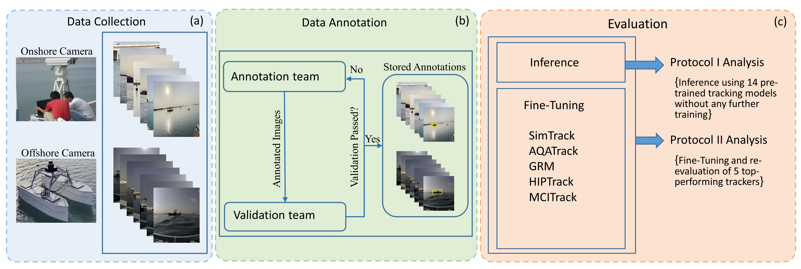

# 🌊 MVTD: Maritime Visual Tracking Dataset

**MVTD** (Maritime Visual Tracking Dataset) is a benchmark dataset and codebase designed to support the **development**, **training**, and **evaluation** of visual tracking models in challenging **maritime environments**.

This repository includes:
- 📦 Tools for model training and testing  
- 🤖 Pretrained model weights  
- 🛠 Scripts for running experiments  
- 📁 User-configurable dataset interface  

---

## 🧭 Overview

Maritime tracking involves challenges such as:
- Motion blur from camera or water movement  
- Occlusion by waves or vessels  
- Reflection and glare on the water  

**MVTD** addresses these with high-quality data and robust baseline models to accelerate research in this domain.

---

## 🚀 Getting Started

### ✅ Step 1: Clone the Repository

    git clone https://github.com/AhsanBaidar/MVTD.git  
    cd MVTD  

### ✅ Step 2: Install Dependencies

    pip install torch torchvision numpy pillow

---

## 📂 Dataset Setup

You need to put your own images in the folders below (Our dataset will be released on paper acceptance):  
The folder and annotation structure of MVTD follows the widely adopted GOT-10k dataset format,  
organizing training videos into subfolders containing frames and annotation files:

    MVTD/
    ├── train/
    │   ├── video1/
    │   │   ├── frame0001.jpg
    │   │   ├── frame0002.jpg
    │   │   ├── ...
    │   │   ├── groundtruth.txt
    │   │   ├── absence.label
    │   │   ├── cut_by_image.label
    │   │   └── cover.label
    │   ├── video2/
    │   │   ├── frame0001.jpg
    │   │   ├── frame0002.jpg
    │   │   ├── ...
    │   │   ├── groundtruth.txt
    │   │   ├── absence.label
    │   │   ├── cut_by_image.label
    │   │   └── cover.label
    │   └── ...
    └── test/
        ├── video1/
        │   ├── frame0001.jpg
        │   ├── frame0002.jpg
        │   ├── ...
        │   └── groundtruth.txt
        ├── video2/
        │   ├── frame0001.jpg
        │   ├── frame0002.jpg
        │   ├── ...
        │   └── groundtruth.txt
        └── ...

---

## 📥 Pretrained Weights

Download the pretrained weights and place them respective folders as inside the link:  
👉 [**Download Weights Here**](https://kuacae-my.sharepoint.com/:f:/g/personal/ahsan_bakht_ku_ac_ae/Evdzhoi7zddBrMg8WCUA1_wBW_-HUnx602doajk9oK9-Kw?e=ItMjwl)  

Note: For SLTTrack and TransT trackers, please place the pretrained weight files inside the directory:
pytracking/Networks/weight_file/

---

## ⚙️ Data Specifications

For Training, you need to modify the files under subfolder data_specs in each tracker folder.

## 🧪 Running the Model

Use the included shell script to run training or testing:

    bash run_command.sh tracker_name test/train

You can modify the script to:
- Switch between training and testing  
---

## 📚 Citation

If you use **MVTD** in your work, please cite:

    @article{bakht2025mvtd,
      author = {Bakht, Ahsan Baidar and Din, Muhayy Ud and Javed, Sajid and Hussain, Irfan},
      title = {MVTD: A Benchmark Dataset for Maritime Visual Object Tracking},
      year = {2025},
      journal = {arXiv preprint arXiv:2506.02866}
    }

---

## Acknowledgments

This work is based on various open-source visual tracking algorithms. We gratefully acknowledge the original authors and communities for their valuable contributions.

---
